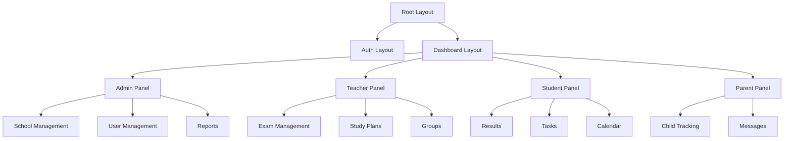
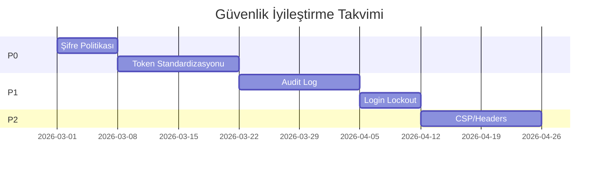
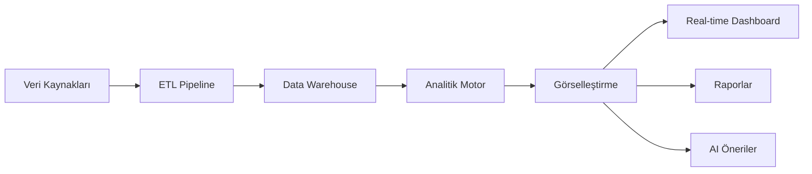
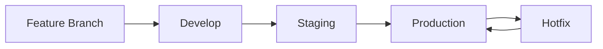
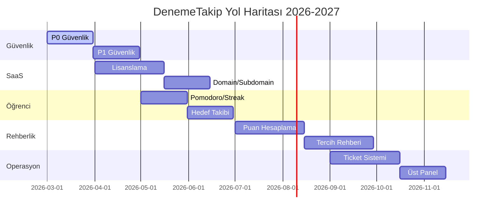

# DenemeTakip Sistemi - Kapsamlı Teknik ve İşlevsel Analiz Raporu V4

**Tarih:** 22 Şubat 2026  
**Hazırlayan:** Mimarlık Analizi  
**Kapsam:** UI/UX, Mimari, Güvenlik, Performans, Ölçeklenebilirlik, Entegrasyonlar, Gelecek Yol Haritası

---

## 📋 İÇİNDEKİLER

1. [Yönetici Özeti](#1-yönetici-özeti)
2. [UI/UX Tasarım Analizi](#2-uiux-tasarım-analizi)
3. [Temel ve İleri Düzey Özellikler](#3-temel-ve-ileri-düzey-özellikler)
4. [Veri Yönetimi ve Depolama Mimarisi](#4-veri-yönetimi-ve-depolama-mimarisi)
5. [Performans Optimizasyonları](#5-performans-optimizasyonları)
6. [Güvenlik Protokolleri](#6-güvenlik-protokolleri)
7. [Entegrasyon Yetenekleri](#7-entegrasyon-yetenekleri)
8. [Ölçeklenebilirlik Altyapısı](#8-ölçeklenebilirlik-altyapısı)
9. [Hata Ayıklama ve Loglama](#9-hata-ayıklama-ve-loglama)
10. [Üçüncü Parti Bağımlılıklar](#10-üçüncü-parti-bağımlılıklar)
11. [Lisanslama Modeli](#11-lisanslama-modeli)
12. [Topluluk Desteği ve Dokümantasyon](#12-topluluk-desteği-ve-dokümantasyon)
13. [Mobil ve Web Platform Uyumluluğu](#13-mobil-ve-web-platform-uyumluluğu)
14. [Erişilebilirlik Standartları](#14-erişilebilirlik-standartları)
15. [Veri Analitiği ve Raporlama](#15-veri-analitiği-ve-raporlama)
16. [Otomatik Yedekleme ve Kurtarma](#16-otomatik-yedekleme-ve-kurtarma)
17. [API Dokümantasyonu ve Genişletilebilirlik](#17-api-dokümantasyonu-ve-genişletilebilirlik)
18. [Kullanıcı Geri Bildirim Mekanizmaları](#18-kullanıcı-geri-bildirim-mekanizmaları)
19. [Sürüm Kontrolü ve Güncelleme Stratejisi](#19-sürüm-kontrolü-ve-güncelleme-stratejisi)
20. [Yük Testi ve Dayanıklılık](#20-yük-testi-ve-dayanıklılık)
21. [Maliyet Yapısı ve İş Modeli](#21-maliyet-yapısı-ve-iş-modeli)
22. [Rekabetçi Avantajlar ve Eksiklikler](#22-rekabetçi-avantajlar-ve-eksiklikler)
23. [Gelecek Yol Haritası](#23-gelecek-yol-haritası)
24. [Geliştirici Ekip Uzmanlık Alanları](#24-geliştirici-ekip-uzmanlık-alanları)
25. [20+ Yeni Özellik Önerileri](#25-20-yeni-özellik-önerileri)
26. [Yardım Dokümantasyonu Yapısı](#26-yardım-dokümantasyonu-yapısı)

---

## 1. Yönetici Özeti

### 1.1 Sistem Durumu

DenemeTakip, eğitim sektörü için geliştirilmiş kapsamlı bir sınav takip ve öğrenme yönetim sistemidir. Mevcut yapı şunları içerir:

| Bileşen | Durum | Detay |
|---------|-------|-------|
| Backend | Üretimde | NestJS 11, Prisma 6, PostgreSQL |
| Frontend | Üretimde | Next.js 16, React 19, Tailwind |
| Veritabanı | 44 model | PostgreSQL + Redis (BullMQ) |
| Güvenlik | Kısmi | JWT + Cookie auth, rate limiting |
| Mobil | PWA | Kısmi destek, tam PWA eksik |

### 1.2 Kritik Bulgular

**Güçlü Yönler:**
- Modüler mimari (17 controller, 18 module)
- Çoklu rol desteği (Admin, Öğretmen, Öğrenci, Veli)
- Kapsamlı raporlama altyapısı
- Mentorluk grupları ve mesajlaşma
- Başarım/rozeti sistemi

**Geliştirme Alanları:**
- Güvenlik sertleştirmesi (şifre politikası, audit log)
- Performans optimizasyonu (N+1 sorgular)
- Mobil deneyim (tam PWA)
- Dokümantasyon eksikliği

---

## 2. UI/UX Tasarım Analizi

### 2.1 Mevcut Tasarım Mimarisi



### 2.2 Tasarım Sistemi

**Renk Paleti:**
- Primary: Mavi tonları (okul/akademik teması)
- Secondary: Turuncu (vurgu/dikkat)
- Success: Yeşil (tamamlama/başarı)
- Warning: Sarı (uyarılar)
- Error: Kırmızı (hatalar)

**Tipografi:**
- Font: Sistem fontları (Inter önerilir)
- Heading: 24px-32px
- Body: 14px-16px
- Small: 12px

**Bileşen Kütüphanesi:**
- Radix UI (temel bileşenler)
- Tailwind CSS (stil)
- Framer Motion (animasyonlar)
- AG Grid (veri tabloları)
- Recharts (grafikler)

### 2.3 Kullanıcı Deneyimi Akışları

#### Öğrenci Deneyimi
1. Login → Dashboard → Sınav Sonuçları
2. Dashboard → Çalışma Planı → Günlük Görevler
3. Dashboard → Mentor Grubu → Paylaşımlar

#### Öğretmen Deneyimi
1. Login → Sınav Yönetimi → Sonuç Girişi
2. Dashboard → Çalışma Planı → Toplu Atama
3. Dashboard → Raporlar → Sınıf Analizi

#### Veli Deneyimi
1. Login → Çocuk Seçimi → Sonuçlar
2. Dashboard → Mesajlar → Öğretmenle İletişim

### 2.4 UI Sorunları ve Çözümleri

| Sorun | Öncelik | Çözüm |
|-------|---------|-------|
| Türkçe karakter bozulması | Yüksek | UTF-8 encoding kontrolü |
| Mobil taşma | Yüksek | Responsive grid düzenlemesi |
| Kart boyutları | Orta | Flexible grid sistemi |
| Erişilebilirlik | Orta | ARIA etiketleri, kontrast oranları |

---

## 3. Temel ve İleri Düzey Özellikler

### 3.1 Temel Özellikler (Mevcut)

#### Sınav Yönetimi
- [x] Deneme oluşturma ve düzenleme
- [x] Cevap anahtarı yükleme
- [x] Excel ile toplu sonuç girişi
- [x] Sınav takvimi ve hatırlatıcılar
- [x] Arşivleme ve yayınlama kontrolü

#### Kullanıcı Yönetimi
- [x] Çoklu rol sistemi (RBAC)
- [x] JWT tabanlı kimlik doğrulama
- [x] Şifre sıfırlama
- [x] Avatar yönetimi
- [x] Okul bazlı tenant izolasyonu

#### Raporlama
- [x] Sınav sonuç raporları
- [x] Sınıf performans analizi
- [x] PDF/Excel export
- [x] Sıralama matrisi
- [x] Yıl bazlı karşılaştırma

#### İletişim
- [x] Mesajlaşma sistemi
- [x] Zamanlanmış mesajlar
- [x] Şablon yönetimi
- [x] Onay akışları

#### Çalışma Planı
- [x] Plan oluşturma
- [x] Görev atama
- [x] İlerleme takibi
- [x] Öğretmen onayı

#### Mentorluk Grupları
- [x] Grup oluşturma
- [x] Öğrenci ekleme/çıkarma
- [x] Hedef belirleme
- [x] Paylaşım ve duyurular

### 3.2 İleri Düzey Özellikler (Planlanan)

#### SaaS Özellikleri
- [ ] Lisanslama ve paketleme
- [ ] Domain/subdomain yönetimi
- [ ] Otomatik kurulum sihirbazı
- [ ] Tenant health monitoring

#### Öğrenci Üretkenlik
- [ ] Pomodoro zamanlayıcı
- [ ] Çalışma serisi (streak)
- [ ] Aktif hedef takibi
- [ ] Kişiselleştirilmiş öneriler

#### Rehberlik
- [ ] TYT/AYT/LGS puan hesaplama
- [ ] Üniversite tercih rehberi
- [ ] LGS hedef lise analizi
- [ ] Kariyer yönlendirme

#### Gelişmiş Raporlama
- [ ] Riskli öğrenci erken uyarı
- [ ] Isı haritası analizi
- [ ] Öğretmen etki raporu
- [ ] Soru kalite analizi

---

## 4. Veri Yönetimi ve Depolama Mimarisi

### 4.1 Veritabanı Şeması

```mermaid
erDiagram
    SCHOOL ||--o{ USER : has
    SCHOOL ||--o{ STUDENT : has
    SCHOOL ||--o{ EXAM : has
    SCHOOL ||--o{ CLASS : has
    SCHOOL ||--o{ GRADE : has
    
    USER ||--o{ MENTORGROUP : manages
    USER ||--o{ MESSAGE : sends
    
    STUDENT ||--o{ EXAMATTEMPT : has
    STUDENT ||--o{ STUDYTASK : assigned
    STUDENT ||--o{ STUDENTACHIEVEMENT : earns
    
    EXAM ||--o{ EXAMATTEMPT : has
    EXAM ||--o{ EXAMNOTIFICATION : has
    
    MENTORGROUP ||--o{ GROUPMEMBERSHIP : has
    MENTORGROUP ||--o{ GROUPGOAL : has
    MENTORGROUP ||--o{ GROUPPOST : has
    
    STUDYPLAN ||--o{ STUDYTASK : contains
    STUDYPLAN ||--o{ GROUPSTUDYPLAN : assigned
```

### 4.2 Veri Modeli Özeti

| Model Kategorisi | Model Sayısı | Örnek Modeller |
|------------------|--------------|----------------|
| Kimlik ve Erişim | 4 | User, Student, Parent, School |
| Sınav | 6 | Exam, ExamAttempt, ExamLessonResult, ExamScore |
| Eğitim | 8 | Subject, Topic, Lesson, StudyPlan, StudyTask |
| Sosyal | 7 | MentorGroup, GroupPost, GroupGoal, Message |
| Sistem | 12 | Backup, Notification, Achievement, Report |

### 4.3 Depolama Stratejisi

**PostgreSQL:**
- İlişkisel veriler (kullanıcılar, sınavlar, sonuçlar)
- ACID işlemler
- JSON alanlar (esnek veri yapıları)

**Redis:**
- Session yönetimi
- BullMQ kuyrukları
- Cache katmanı (planlanan)

**Dosya Sistemi:**
- Uploads/ (Excel import dosyaları)
- Private/ (Cevap anahtarları)
- Public/ (Logolar, görseller)

### 4.4 Veri Yedekleme

```typescript
// Mevcut Backup Modeli
model Backup {
  id        String   @id @default(uuid())
  filename  String
  size      Int
  schoolId  String
  createdAt DateTime @default(now())
  data      String?  // JSON serialized data
}
```

**Yedekleme Stratejisi:**
- Günlük otomatik yedekleme
- Okul bazlı izole yedekler
- JSON export/import
- 30 günlük saklama

---

## 5. Performans Optimizasyonları

### 5.1 Mevcut Performans Metrikleri

| Endpoint | Ortalama Yanıt Süresi | Durum |
|----------|----------------------|-------|
| GET /api/health | ~0.25s | İyi |
| POST /auth/login | ~0.21s | İyi |
| GET /students/me/exams | ~0.18s | İyi |
| GET /achievements/student/{id} | ~0.21s | İyi |

### 5.2 Performans Riskleri

#### N+1 Sorgu Problemi
```typescript
// Riskli Kod: reports.service.ts:716, :858
// Çözüm: Toplu query + memory map
const attempts = await prisma.examAttempt.findMany({
  where: { examId: { in: examIds } },
  include: { lessonResults: true }
});
const attemptMap = new Map(attempts.map(a => [a.id, a]));
```

#### Toplu İşlem Optimizasyonu
```typescript
// Eski: Tekil create
for (const task of tasks) {
  await prisma.studyTask.create({ data: task });
}

// Yeni: createMany
await prisma.studyTask.createMany({ data: tasks });
```

### 5.3 Önerilen Optimizasyonlar

| Öncelik | Optimizasyon | Beklenen Kazanım |
|---------|--------------|------------------|
| Yüksek | Redis cache katmanı | %70 daha hızlı raporlar |
| Yüksek | N+1 kırılması | %50 daha az DB sorgusu |
| Orta | createMany kullanımı | %80 daha hızlı toplu işlemler |
| Orta | Connection pool tuning | Daha iyi eşzamanlılık |
| Düşük | Materialized views | Anlık rapor hızı |

### 5.4 Frontend Performans

**Mevcut Durum:**
- 231 fetch çağrısı (dağınık)
- 86 useEffect
- Sadece 5 Promise.all kullanımı

**İyileştirmeler:**
- API client standardizasyonu
- React Query/SWR entegrasyonu
- Code splitting ve lazy loading
- next/image optimizasyonu

---

## 6. Güvenlik Protokolleri

### 6.1 Mevcut Güvenlik Önlemleri

| Katman | Önlem | Durum |
|--------|-------|-------|
| Kimlik Doğrulama | JWT + HttpOnly Cookie | Kısmi |
| Yetkilendirme | RBAC + Roles Guard | Aktif |
| Rate Limiting | @nestjs/throttler | Aktif |
| CORS | .env yönetimi | Kısmi |
| Şifreleme | bcrypt (10 rounds) | Aktif |
| Tenant İzolasyonu | schoolId filtreleme | Aktif |

### 6.2 Güvenlik Açıkları ve Çözümleri

#### P0 (Acil)
1. **Varsayılan Şifre:** `123456` kullanımı
   - Risk: Hesap ele geçirme
   - Çözüm: Secure random şifre + zorunlu değişim

2. **Şifre Politikası:** Min 4 karakter
   - Risk: Zayıf parola
   - Çözüm: Min 8 karakter, karmaşıklık kuralları

3. **Token Taşıma:** localStorage + cookie karışımı
   - Risk: XSS, tutarsız davranış
   - Çözüm: Cookie-first standardı

#### P1 (Yüksek)
1. **Login Lockout:** Brute force koruması
2. **Audit Log:** Kim ne zaman ne yaptı
3. **Token Revoke:** Oturum yönetimi
4. **Upload Güvenliği:** Magic number kontrolü

#### P2 (Orta)
1. **CSP Headers:** İçerik güvenlik politikası
2. **Security Headers:** HSTS, X-Frame-Options
3. **Pentest:** Periyodik güvenlik testleri

### 6.3 Güvenlik Yol Haritası



---

## 7. Entegrasyon Yetenekleri

### 7.1 Mevcut Entegrasyonlar

| Entegrasyon | Kullanım | Durum |
|-------------|----------|-------|
| PostgreSQL | Ana veritabanı | Aktif |
| Redis | Kuyruk ve cache | Aktif |
| Nodemailer | E-posta gönderimi | Aktif |
| ExcelJS | Excel import/export | Aktif |
| PDFKit | PDF raporları | Aktif |
| Sharp | Görsel işleme | Aktif |
| Web Push | Bildirimler | Aktif |

### 7.2 Planlanan Entegrasyonlar

#### E-Posta Servisleri
- SendGrid (transactional)
- AWS SES (bulk)
- Mailgun (alternatif)

#### Bulut Depolama
- AWS S3 (dosya saklama)
- CloudFront (CDN)
- DigitalOcean Spaces

#### Ödeme Sistemleri
- Stripe (abonelik yönetimi)
- PayTR (yerel ödeme)
- Iyzico (alternatif)

#### Analitik
- Google Analytics 4
- Mixpanel (ürün analitiği)
- Sentry (hata izleme)

#### SSO/OAuth
- Google OAuth
- Microsoft Entra ID
- Apple Sign In

### 7.3 API Entegrasyon Mimarisi

```typescript
// Entegrasyon servis şablonu
interface IntegrationAdapter {
  connect(config: IntegrationConfig): Promise<Connection>;
  disconnect(): Promise<void>;
  sync(data: SyncData): Promise<SyncResult>;
  health(): Promise<HealthStatus>;
}

@Injectable()
class EmailIntegrationService implements IntegrationAdapter {
  // Implementation
}
```

---

## 8. Ölçeklenebilirlik Altyapısı

### 8.1 Mevcut Mimari

```
┌─────────────────────────────────────┐
│           Load Balancer             │
└──────────────┬──────────────────────┘
               │
       ┌───────┴───────┐
       │               │
┌──────▼──────┐ ┌──────▼──────┐
│   App #1    │ │   App #2    │
│  (NestJS)   │ │  (NestJS)   │
└──────┬──────┘ └──────┬──────┘
       │               │
       └───────┬───────┘
               │
    ┌──────────┼──────────┐
    │          │          │
┌───▼───┐ ┌───▼───┐ ┌───▼───┐
│Postgre│ │ Redis │ │ Files │
│  SQL   │ │       │ │       │
└────────┘ └───────┘ └───────┘
```

### 8.2 Ölçeklenebilirlik Stratejisi

#### Yatay Ölçekleme
- Stateless uygulama sunucuları
- Redis session yönetimi
- PostgreSQL read replicas

#### Dikey Ölçekleme
- CPU/Memory artırımı
- Connection pool tuning
- Cache boyutu artırımı

#### Veritabanı Ölçekleme
```sql
-- Read replica kullanımı
-- Master: Yazma işlemleri
-- Replica 1: Raporlama sorguları
-- Replica 2: Analitik sorgular
```

### 8.3 Kapasite Planlaması

| Metrik | Mevcut | Hedef (1Yıl) | Hedef (3Yıl) |
|--------|--------|--------------|--------------|
| Aktif Okul | 10 | 100 | 500 |
| Aktif Öğrenci | 1,000 | 10,000 | 100,000 |
| Günlük Sınav | 50 | 500 | 5,000 |
| Depolama | 10GB | 100GB | 1TB |

---

## 9. Hata Ayıklama ve Loglama

### 9.1 Mevcut Loglama Durumu

**Konsol Logları:**
- `console.log`: 53 adet
- `console.error`: 186 adet
- Yapılandırılmış log standardı: Yok

### 9.2 Önerilen Loglama Mimarisi

```typescript
// Structured Logging Service
@Injectable()
class LoggerService {
  log(context: string, message: string, metadata?: LogMetadata);
  error(context: string, error: Error, metadata?: LogMetadata);
  warn(context: string, message: string, metadata?: LogMetadata);
  debug(context: string, message: string, metadata?: LogMetadata);
}

// Log Format
interface LogEntry {
  timestamp: string;
  level: 'DEBUG' | 'INFO' | 'WARN' | 'ERROR';
  context: string;
  message: string;
  userId?: string;
  schoolId?: string;
  requestId?: string;
  metadata?: Record<string, any>;
}
```

### 9.3 Hata İzleme Entegrasyonu

| Seviye | Araç | Kullanım |
|--------|------|----------|
| Uygulama | Sentry | Runtime hataları |
| Altyapı | Datadog/New Relic | Performans metrikleri |
| Log | ELK Stack | Merkezi log yönetimi |
| Metrik | Prometheus + Grafana | Özel metrikler |

### 9.4 Debug Modülleri

```typescript
// Health Check Endpoint
@Controller('health')
class HealthController {
  @Get()
  check(): HealthStatus;
  
  @Get('db')
  checkDatabase(): DatabaseStatus;
  
  @Get('redis')
  checkRedis(): RedisStatus;
}
```

---

## 10. Üçüncü Parti Bağımlılıklar

### 10.1 Backend Bağımlılıkları

| Kategori | Paket | Versiyon | Kullanım |
|----------|-------|----------|----------|
| Framework | @nestjs/core | ^11.0.1 | Ana framework |
| ORM | @prisma/client | ^6.2.1 | Veritabanı erişimi |
| Auth | @nestjs/jwt | ^11.0.2 | JWT işlemleri |
| Queue | bullmq | ^5.66.7 | Kuyruk yönetimi |
| Validation | class-validator | ^0.14.3 | DTO validasyonu |
| Excel | exceljs | ^4.4.0 | Excel işlemleri |
| PDF | pdfkit | ^0.17.2 | PDF oluşturma |
| Email | nodemailer | ^7.0.13 | E-posta gönderimi |
| Security | helmet | ^8.1.0 | Güvenlik headerları |
| Rate Limit | @nestjs/throttler | ^6.5.0 | Rate limiting |

### 10.2 Frontend Bağımlılıkları

| Kategori | Paket | Versiyon | Kullanım |
|----------|-------|----------|----------|
| Framework | next | ^16.1.6 | React framework |
| UI | @radix-ui/* | ^1.x | Temel bileşenler |
| Styling | tailwindcss | ^4 | CSS framework |
| Animation | framer-motion | ^12.29.0 | Animasyonlar |
| Charts | recharts | ^3.7.0 | Grafikler |
| Grid | ag-grid-react | ^35.0.1 | Veri tabloları |
| Icons | lucide-react | ^0.563.0 | İkonlar |
| HTTP | axios | ^1.13.2 | API istekleri |
| Date | date-fns | ^4.1.0 | Tarih işlemleri |

### 10.3 Güvenlik Güncellemeleri

```bash
# Güvenlik taraması
npm audit

# Otomatik düzeltme
npm audit fix

# Manuel inceleme gerektirenler
npm audit fix --force # Dikkatli kullan
```

---

## 11. Lisanslama Modeli

### 11.1 Önerilen Lisanslama Yapısı

```typescript
// License Plan Modeli
model LicensePlan {
  id              String    @id @default(uuid())
  name            String    // Starter, Professional, Enterprise
  description     String?
  priceMonthly    Decimal
  priceYearly     Decimal
  maxStudents     Int
  maxTeachers     Int
  maxStorageGB    Int
  maxExamsPerMonth Int
  features        Json      // ["advanced_reports", "api_access", "white_label"]
  isActive        Boolean   @default(true)
}

// School License Modeli
model SchoolLicense {
  id              String    @id @default(uuid())
  schoolId        String    @unique
  planId          String
  status          LicenseStatus @default(ACTIVE)
  startedAt       DateTime
  expiresAt       DateTime
  gracePeriodEnd  DateTime?
  studentCount    Int       @default(0)
  storageUsedGB   Decimal   @default(0)
  lastRenewalAt   DateTime?
  autoRenew       Boolean   @default(true)
}
```

### 11.2 Paket Önerileri

| Paket | Fiyat (Aylık) | Öğrenci | Özellikler |
|-------|---------------|---------|------------|
| Starter | ₺499 | 100 | Temel özellikler |
| Professional | ₺1,499 | 500 | Gelişmiş raporlar, API |
| Enterprise | ₺4,999 | Sınırsız | Özel geliştirme, SLA |

### 11.3 Lisans Kontrol Mekanizması

```typescript
@Injectable()
class LicenseGuard implements CanActivate {
  async canActivate(context: ExecutionContext): Promise<boolean> {
    const request = context.switchToHttp().getRequest();
    const schoolId = request.user.schoolId;
    
    const license = await this.licenseService.getActiveLicense(schoolId);
    
    // Limit kontrolleri
    if (await this.exceedsStudentLimit(schoolId, license)) {
      throw new ForbiddenException('Öğrenci limiti aşıldı');
    }
    
    // Süre kontrolü
    if (license.expiresAt < new Date()) {
      await this.licenseService.setReadOnlyMode(schoolId);
      throw new ForbiddenException('Lisans süresi doldu');
    }
    
    return true;
  }
}
```

---

## 12. Topluluk Desteği ve Dokümantasyon

### 12.1 Mevcut Dokümantasyon

| Doküman | Konum | Durum |
|---------|-------|-------|
| README | backend/README.md | Temel |
| Kurulum | DIGITALOCEAN_PUSH_KURULUMU.md | Teknik |
| Planlar | plans/ | Çeşitli |
| Hata Rehberi | backend/LMS_ERRORS_GUIDE.md | Teknik |

### 12.2 Eksik Dokümantasyon

- [ ] API referansı (Swagger/OpenAPI)
- [ ] Frontend bileşen kataloğu
- [ ] Kullanıcı kılavuzları
- [ ] Yönetici kılavuzları
- [ ] Geliştirici kılavuzları
- [ ] Video eğitimler
- [ ] SSS (FAQ)

### 12.3 Dokümantasyon Stratejisi

```
docs/
├── api/
│   ├── openapi.yaml
│   ├── authentication.md
│   └── endpoints/
├── user-guides/
│   ├── admin/
│   ├── teacher/
│   ├── student/
│   └── parent/
├── developer/
│   ├── setup.md
│   ├── architecture.md
│   └── contributing.md
└── video-tutorials/
```

---

## 13. Mobil ve Web Platform Uyumluluğu

### 13.1 Mevcut Destek

| Platform | Durum | Notlar |
|----------|-------|--------|
| Web (Desktop) | Tam | Chrome, Firefox, Safari, Edge |
| Web (Tablet) | Kısmi | Responsive düzenlemeler gerekli |
| Web (Mobile) | Kısmi | PWA eksik, UI taşmaları |
| iOS Native | Yok | PWA ile kısmi deneyim |
| Android Native | Yok | PWA ile kısmi deneyim |

### 13.2 PWA Gereksinimleri

**Eksik Dosyalar:**
- [ ] `/sw.js` (Service Worker)
- [ ] Iconlar: 96x96, 128x128, 152x152, 384x384
- [ ] Screenshots
- [ ] `manifest.json` güncelleme

**PWA Özellikleri:**
- [ ] Offline çalışma
- [ ] Push bildirimler
- [ ] Ana ekrana ekleme
- [ ] Arka plan senkronizasyonu

### 13.3 Responsive Tasarım Kontrol Listesi

| Ekran Boyutu | Durum | Sorunlar |
|--------------|-------|----------|
| 1920px+ | İyi | - |
| 1366px | İyi | - |
| 1024px (tablet) | Kısmi | Kart boyutları |
| 768px (tablet) | Kısmi | Taşmalar |
| 375px (mobile) | Zayıf | Menü, kartlar, tablolar |

---

## 14. Erişilebilirlik Standartları

### 14.1 WCAG 2.1 Uyumluluğu

| Kriter | Seviye | Durum |
|--------|--------|-------|
| Klavye erişimi | A | Kısmi |
| Ekran okuyucu | A | Eksik |
| Kontrast oranı | AA | Kontrol edilmeli |
| Metin boyutu | AA | Uygun |
| Odak göstergesi | AA | Eksik |

### 14.2 İyileştirme Planı

1. **ARIA Etiketleri**
   ```tsx
   <button aria-label="Sınav sonuçlarını görüntüle">
     <EyeIcon />
   </button>
   ```

2. **Klavye Navigasyonu**
   - Tab sırası optimizasyonu
   - Klavye kısayolları
   - Skip links

3. **Kontrast Oranları**
   - Minimum 4.5:1 (normal metin)
   - Minimum 3:1 (büyük metin)

4. **Ekran Okuyucu Desteği**
   - Semantic HTML
   - Alt metinler
   - Live regions

---

## 15. Veri Analitiği ve Raporlama

### 15.1 Mevcut Rapor Türleri

| Rapor | Rol | Format |
|-------|-----|--------|
| Sınav Özeti | Tümü | PDF, Excel |
| Detaylı Sonuç | Tümü | PDF, Excel |
| Ders Analizi | Admin, Öğretmen | PDF, Excel |
| Sıralama Matrisi | Admin, Öğretmen | Excel |
| Yıl Karşılaştırma | Admin | Excel |

### 15.2 Gelişmiş Analitik Özellikleri

#### Öğrenci Gelişim Takibi
```typescript
interface StudentProgressAnalytics {
  studentId: string;
  examType: ExamType;
  netTrend: TrendLine[];
  subjectBreakdown: SubjectPerformance[];
  percentileHistory: PercentilePoint[];
  predictedScore: number;
  riskFactors: RiskFactor[];
}
```

#### Sınıf Isı Haritası
```typescript
interface ClassHeatmapData {
  classId: string;
  subject: string;
  topics: {
    name: string;
    mastery: number; // 0-100
    avgNet: number;
  }[];
}
```

#### Öğretmen Etki Analizi
```typescript
interface TeacherImpactReport {
  teacherId: string;
  classes: ClassImpact[];
  avgImprovement: number;
  strongestSubjects: string[];
  improvementAreas: string[];
}
```

### 15.3 Analitik Dashboard



---

## 16. Otomatik Yedekleme ve Kurtarma

### 16.1 Mevcut Yedekleme

```typescript
// Backup modeli mevcut
model Backup {
  id        String   @id @default(uuid())
  filename  String
  size      Int
  schoolId  String
  createdAt DateTime @default(now())
  data      String?  // JSON
}
```

### 16.2 Gelişmiş Yedekleme Stratejisi

#### Seviyeler
1. **Gerçek Zamanlı:** Transaction log shipping
2. **Günlük:** Tam veritabanı yedeği
3. **Haftalık:** Okul bazlı JSON export
4. **Aylık:** Arşiv yedekleme

#### Saklama Politikası
| Yedek Türü | Saklama Süresi | Konum |
|------------|----------------|-------|
| Transaction | 7 gün | Lokal |
| Günlük | 30 gün | Bulut |
| Haftalık | 90 gün | Bulut |
| Aylık | 1 yıl | Soğuk depolama |

### 16.3 Disaster Recovery

```yaml
RTO (Recovery Time Objective): 4 saat
RPO (Recovery Point Objective): 1 saat

Senaryolar:
  1. Tekil okul veri kaybı: JSON restore (15 dk)
  2. Veritabanı çökmesi: Replica promote (30 dk)
  3. Tam sistem çökmesi: Bulut restore (2 saat)
```

---

## 17. API Dokümantasyonu ve Genişletilebilirlik

### 17.1 Mevcut API Yapısı

| HTTP Metodu | Endpoint Sayısı |
|-------------|-----------------|
| GET | 86 |
| POST | 71 |
| PATCH | 19 |
| PUT | 6 |
| DELETE | 22 |

### 17.2 Swagger/OpenAPI Entegrasyonu

```typescript
// @nestjs/swagger zaten mevcut
@Controller('api')
@ApiTags('exams')
export class ExamsController {
  @Get(':id')
  @ApiOperation({ summary: 'Sınav detayını getir' })
  @ApiResponse({ status: 200, type: ExamResponseDto })
  @ApiResponse({ status: 404, description: 'Sınav bulunamadı' })
  async findOne(@Param('id') id: string): Promise<ExamResponseDto>;
}
```

### 17.3 Genişletilebilirlik Prensipleri

#### Plugin Mimarisi
```typescript
interface Plugin {
  name: string;
  version: string;
  hooks: {
    onInstall: () => Promise<void>;
    onUninstall: () => Promise<void>;
    onEnable: () => Promise<void>;
    onDisable: () => Promise<void>;
  };
  routes: RouteConfig[];
  menuItems: MenuItem[];
}
```

#### Webhook Sistemi
```typescript
interface WebhookConfig {
  url: string;
  events: WebhookEvent[];
  secret: string;
  active: boolean;
}

type WebhookEvent = 
  | 'exam.created'
  | 'exam.completed'
  | 'student.enrolled'
  | 'result.entered';
```

---

## 18. Kullanıcı Geri Bildirim Mekanizmaları

### 18.1 Mevcut Mekanizmalar

- [x] İletişim formu
- [x] E-posta desteği
- [ ] Ticket sistemi (planlanan)
- [ ] In-app feedback
- [ ] NPS anketi

### 18.2 Ticket Sistemi Tasarımı

```typescript
// Ticket Domain Modeli
model SupportTicket {
  id          String    @id @default(uuid())
  schoolId    String
  userId      String
  category    TicketCategory
  priority    TicketPriority @default(MEDIUM)
  status      TicketStatus @default(OPEN)
  subject     String
  description String
  createdAt   DateTime  @default(now())
  updatedAt   DateTime  @updatedAt
  resolvedAt  DateTime?
  
  messages    SupportTicketMessage[]
  slaEvents   SupportSLAEvent[]
}

model SupportTicketMessage {
  id        String   @id @default(uuid())
  ticketId  String
  userId    String
  message   String
  isInternal Boolean @default(false)
  createdAt DateTime @default(now())
}
```

### 18.3 Feedback Toplama Stratejisi

| Kanal | Yöntem | Sıklık |
|-------|--------|--------|
| In-app | Thumbs up/down | Her özellik |
| E-posta | NPS anketi | Aylık |
| Modal | Feature request | Sürekli |
| Interview | Kullanıcı görüşmesi | 3 aylık |

---

## 19. Sürüm Kontrolü ve Güncelleme Stratejisi

### 19.1 Versiyonlama Şeması

SemVer kullanımı: `MAJOR.MINOR.PATCH`

| Bileşen | Anlamı | Örnek |
|---------|--------|-------|
| MAJOR | Kırıcı değişiklikler | 2.0.0 |
| MINOR | Yeni özellikler | 1.5.0 |
| PATCH | Hata düzeltmeleri | 1.4.3 |

### 19.2 Yayın Akışı



### 19.3 Güncelleme Stratejisi

| Ortam | Güncelleme Sıklığı | Yöntem |
|-------|-------------------|--------|
| Development | Anlık | Otomatik deploy |
| Staging | Günlük | Manuel onay |
| Production | Haftalık | Blue-green deploy |

### 19.4 Geri Alma (Rollback) Planı

```bash
# Otomatik rollback tetikleyicileri
- Hata oranı > %5
- Yanıt süresi > 2s (p95)
- Başarısız health check

# Rollback süresi hedefi: < 5 dakika
```

---

## 20. Yük Testi ve Dayanıklılık

### 20.1 Test Senaryoları

| Senaryo | Eşzamanlı Kullanıcı | Hedef |
|---------|---------------------|-------|
| Normal kullanım | 100 | p95 < 500ms |
| Sınav sonuç girişi | 500 | p95 < 1s |
| Rapor oluşturma | 50 | p95 < 3s |
| Excel import | 20 | p95 < 10s |

### 20.2 Yük Test Araçları

- **k6:** JavaScript tabanlı yük testi
- **Gatling:** Scala tabanlı, detaylı raporlama
- **Artillery:** Node.js tabanlı, kolay kullanım

### 20.3 Örnek k6 Test Senaryosu

```javascript
import http from 'k6/http';
import { check, sleep } from 'k6';

export const options = {
  stages: [
    { duration: '2m', target: 100 },
    { duration: '5m', target: 100 },
    { duration: '2m', target: 200 },
    { duration: '5m', target: 200 },
    { duration: '2m', target: 0 },
  ],
};

export default function () {
  const res = http.get('https://api.denemetakip.net/health');
  check(res, { 'status is 200': (r) => r.status === 200 });
  sleep(1);
}
```

---

## 21. Maliyet Yapısı ve İş Modeli

### 21.1 Altyapı Maliyetleri (Aylık)

| Bileşen | Konfigürasyon | Maliyet |
|---------|---------------|---------|
| Uygulama Sunucusu | 4 vCPU, 8GB RAM | $40 |
| PostgreSQL | 2 vCPU, 4GB RAM | $30 |
| Redis | 1GB | $15 |
| Depolama | 100GB SSD | $10 |
| CDN | 500GB bant genişliği | $10 |
| Toplam | - | ~$105/ay |

### 21.2 Geliştirme Maliyetleri

| Rol | Süre | Maliyet |
|-----|------|---------|
| Backend Developer | 6 ay | $30,000 |
| Frontend Developer | 6 ay | $24,000 |
| DevOps Engineer | 3 ay | $12,000 |
| UI/UX Designer | 2 ay | $6,000 |
| QA Engineer | 2 ay | $6,000 |
| Toplam | - | ~$78,000 |

### 21.3 Gelir Projeksiyonu

| Yıl | Aktif Okul | Aylık Gelir | Yıllık Gelir |
|-----|------------|-------------|--------------|
| 1 | 20 | ₺30,000 | ₺360,000 |
| 2 | 100 | ₺150,000 | ₺1,800,000 |
| 3 | 300 | ₺450,000 | ₺5,400,000 |

---

## 22. Rekabetçi Avantajlar ve Eksiklikler

### 22.1 Rekabetçi Avantajlar

| Avantaj | Açıklama |
|---------|----------|
| Modüler yapı | Kolay genişletilebilirlik |
| Çoklu rol | Tek platformda tüm paydaşlar |
| Mentorluk grupları | Benzersiz özellik |
| Başarım sistemi | Gamification |
| Açık kaynak potansiyeli | Topluluk katkısı |

### 22.2 Eksiklikler ve Riskler

| Eksiklik | Risk Seviyesi | Çözüm |
|----------|---------------|-------|
| Mobil uygulama | Yüksek | PWA/native app |
| AI desteği | Orta | ML modelleri entegrasyonu |
| Entegrasyonlar | Orta | API ve webhook sistemi |
| Dokümantasyon | Orta | Kapsamlı docs |
| Topluluk | Düşük | Açık kaynak stratejisi |

### 22.3 Rakip Analizi

| Rakip | Güçlü Yön | Zayıf Yön |
|-------|-----------|-----------|
| ÖSYM AİS | Resmi veri | Sadece sınav sonuçları |
| E-Okul | Kapsamlı | Karmaşık arayüz |
| Özel yazılımlar | Özelleştirme | Maliyetli |

---

## 23. Gelecek Yol Haritası

### 23.1 Kısa Vadeli (0-6 Ay)

| Çeyrek | Hedefler |
|--------|----------|
| Q1 2026 | Güvenlik sertleştirme, encoding düzeltmeleri |
| Q2 2026 | SaaS altyapısı, lisanslama, domain yönetimi |

### 23.2 Orta Vadeli (6-18 Ay)

| Çeyrek | Hedefler |
|--------|----------|
| Q3 2026 | Pomodoro, streak, hedef takibi |
| Q4 2026 | Puan hesaplama, tercih rehberi |
| Q1 2027 | Ticket sistemi, üst panel |
| Q2 2027 | Gelişmiş raporlar, AI önerileri |

### 23.3 Uzun Vadeli (18-36 Ay)

| Çeyrek | Hedefler |
|--------|----------|
| Q3-Q4 2027 | Mobil uygulama, ML modelleri |
| 2028 | Uluslararası genişleme, API marketplace |

### 23.4 Yol Haritası Görseli



---

## 24. Geliştirici Ekip Uzmanlık Alanları

### 24.1 Gerekli Uzmanlıklar

| Alan | Seviye | Görevler |
|------|--------|----------|
| Backend (NestJS) | Uzman | API, servisler, optimizasyon |
| Frontend (Next.js) | Uzman | UI/UX, performans, PWA |
| Veritabanı (PostgreSQL) | İleri | Şema tasarımı, optimizasyon |
| DevOps (Docker/K8s) | İleri | CI/CD, deployment, monitoring |
| Güvenlik | İleri | Audit, pentest, sertleştirme |
| ML/AI | Orta | Öneri motoru, tahmin modelleri |
| UI/UX Tasarım | Orta | Tasarım sistemi, erişilebilirlik |

### 24.2 Ekip Yapısı Önerisi

```
Core Team (3-4 kişi):
├── Tech Lead (Full-stack)
├── Backend Developer
├── Frontend Developer
└── DevOps Engineer

Extended Team (2-3 kişi):
├── UI/UX Designer
├── QA Engineer
└── Technical Writer
```

---

## 25. 20+ Yeni Özellik Önerileri

Aşağıdaki özellikler mevcut planlarda (V2, V3) yer almayan ancak projeye değer katacak yeniliklerdir:

### 25.1 Öğrenme ve Gelişim (1-5)

#### 1. AI Destekli Çalışma Planı Optimizasyonu
- Öğrencinin geçmiş performansına göre kişiselleştirilmiş çalışma planı
- Zayıf konulara odaklanma önerileri
- Optimal çalışma saatleri analizi

```typescript
interface AIOptimizedPlan {
  studentId: string;
  recommendedSchedule: DailySchedule[];
  focusAreas: Topic[];
  estimatedImprovement: number;
  confidenceScore: number;
}
```

#### 2. Mikro Öğrenme Modülü
- 5-15 dakikalık kısa dersler
- Flashcard sistemi
- Hafıza oyunları
- Spaced repetition algoritması

#### 3. Peer-to-Peer Öğrenme Ağı
- Öğrenci eşleştirme (güçlü-zayıf)
- Sanal çalışma odaları
- Soru-cevap platformu
- Video ders paylaşımı

#### 4. Sanal Laboratuvar (Fen Bilimleri)
- Simülasyon tabanlı deneyler
- 3D molekül görüntüleyici
- Fizik simülasyonları
- Biyoloji modellemeleri

#### 5. Sesli Not ve Diktasyon
- Ders notlarını sesli kaydetme
- Otomatik metne çevirme
- Sesli soru çözümü
- Podcast formatında ders özeti

### 25.2 Değerlendirme ve Analiz (6-10)

#### 6. Uyarlanabilir Sınav Sistemi
- Öğrenci seviyesine göre soru zorluğu ayarlama
- CAT (Computer Adaptive Testing)
- Anında geri bildirim
- Zayıf alan tespiti

#### 7. Video Proktorlük
- Online sınavlarda kamera izleme
- Yüz tanıma ile kimlik doğrulama
- Şüpheli hareket algılama
- Otomasyon + insan kontrolü

#### 8. Soru Bankası ve Otomatik Test Oluşturma
- 10,000+ soruluk havuz
- Konu/zorluk filtreleme
- Otomatik test oluşturma
- PDF/Word export

#### 9. Yanlış Analizi ve Kategori Sınıflandırma
- Bilgi eksikliği
- Dikkat hatası
- Zaman yönetimi
- Kavram yanılgısı

#### 10. Tahmine Dayalı Performans Modeli
- Sınav sonucu tahmini
- Üniversite kazanma olasılığı
- Riskli öğrenci erken uyarı
- Trend analizi ve uyarılar

### 25.3 İletişim ve İşbirliği (11-15)

#### 11. Canlı Ders Entegrasyonu
- Zoom/Jitsi entegrasyonu
- Ders kaydı ve arşiv
- Etkileşimli beyaz tahta
- Anlık anket ve quiz

#### 12. Veli-Öğretmen Görüntülü Görüşme
- Randevu sistemi
- Video konferans
- Görüşme notları
- Takip görevleri

#### 13. Okul İçi Sosyal Ağ
- Öğrenci profilleri
- Başarı duvarı
- Yarışmalar ve etkinlikler
- Kulüp yönetimi

#### 14. Ortak Çalışma Alanları
- Gerçek zamanlı doküman editörü
- Grup projesi yönetimi
- Görev atama ve takibi
- Versiyon kontrolü

#### 15. Ebeveyn Kontrol ve İzleme Uygulaması
- Ayrı veli mobil uygulaması
- Günlük özet bildirimleri
- Ekran süresi takibi
- Uygulama kullanım raporu

### 25.4 Yönetim ve Operasyon (16-20)

#### 16. Otomatik Sınıf Atlama Sihirbazı
- Öğrenci başarı analizi
- Otomatik sınıf atama
- Veri taşıma ve arşivleme
- Veli bilgilendirme

#### 17. Kaynak ve Kütüphane Yönetimi
- Dijital kütüphane
- Kitap ödünç alma takibi
- Kaynak rezervasyonu
- QR kod ile kaynak yönetimi

#### 18. Yemekhane ve Servis Takibi
- Günlük yemek menüsü
- Öğrenci yemek tercihleri
- Servis güzergah takibi
- QR kod ile yemek girişi

#### 19. Öğretmen Performans Değerlendirme
- 360 derece geri bildirim
- Öğrenci memnuniyet anketi
- Ders gözlem formları
- Gelişim planı oluşturma

#### 20. Finans ve Ödeme Takibi
- Öğrenci ücret takibi
- Taksit yönetimi
- Ödeme hatırlatmaları
- Finansal raporlar

### 25.5 İleri Düzey Özellikler (21-25)

#### 21. Blockchain Tabanlı Sertifika ve Başarı Kaydı
- Değiştirilemez başarı kaydı
- Dijital sertifika
- Üniversite entegrasyonu
- Doğrulama sistemi

#### 22. AR/VR Entegrasyonu
- Sanal sınıf turları
- 3D anatomi modelleri
- Tarihi olay simülasyonları
- Kimyasal deney simülasyonları

#### 23. Çoklu Dil Desteği ve Lokalizasyon
- İngilizce, Arapça, Rusça
- RTL dil desteği
- Kültürel uyarlamalar
- Otomatik çeviri önerileri

#### 24. IoT Entegrasyonu
- Akıllı kart okuyucu
- Sıcaklık/nem sensörü
- Yoklama sistemi
- Güvenlik kamerası entegrasyonu

#### 25. API Marketplace ve Geliştirici Portalı
- 3. parti entegrasyonlar
- Webhook yönetimi
- API anahtarı yönetimi
- Geliştirici dokümantasyonu

---

## 26. Yardım Dokümantasyonu Yapısı

### 26.1 Dokümantasyon Hiyerarşisi

```
docs/
├── README.md
├── getting-started/
│   ├── index.md
│   ├── installation.md
│   ├── configuration.md
│   └── first-steps.md
├── user-guides/
│   ├── admin/
│   │   ├── index.md
│   │   ├── school-setup.md
│   │   ├── user-management.md
│   │   ├── exam-management.md
│   │   ├── reports.md
│   │   └── settings.md
│   ├── teacher/
│   │   ├── index.md
│   │   ├── exam-creation.md
│   │   ├── result-entry.md
│   │   ├── study-plans.md
│   │   ├── groups.md
│   │   └── messaging.md
│   ├── student/
│   │   ├── index.md
│   │   ├── viewing-results.md
│   │   ├── study-tasks.md
│   │   ├── achievements.md
│   │   └── groups.md
│   └── parent/
│       ├── index.md
│       ├── tracking-children.md
│       ├── messages.md
│       └── notifications.md
├── api/
│   ├── index.md
│   ├── authentication.md
│   ├── endpoints/
│   │   ├── auth.md
│   │   ├── exams.md
│   │   ├── students.md
│   │   └── ...
│   └── webhooks.md
├── developer/
│   ├── index.md
│   ├── architecture.md
│   ├── database-schema.md
│   ├── contributing.md
│   ├── coding-standards.md
│   └── testing.md
├── faq/
│   ├── index.md
│   ├── general.md
│   ├── technical.md
│   └── troubleshooting.md
├── troubleshooting/
│   ├── index.md
│   ├── common-issues.md
│   ├── error-codes.md
│   └── support.md
└── changelog/
    ├── index.md
    └── versions/
        ├── v1.0.0.md
        └── v1.1.0.md
```

### 26.2 Her Doküman İçin Şablon

```markdown
# [Sayfa Başlığı]

## Genel Bakış
[Kısa açıklama]

## Ön Koşullar
- Gereksinim 1
- Gereksinim 2

## Adım Adım Kılavuz

### Adım 1: [Başlık]
1. [Talimat]
2. [Talimat]

### Adım 2: [Başlık]
[Screenshot]

## Sık Karşılaşılan Sorunlar

### Sorun: [Sorun adı]
**Çözüm:** [Çözüm açıklaması]

## İlgili Konular
- [Bağlantı 1]
- [Bağlantı 2]

## Geri Bildirim
Bu doküman hakkında geri bildirim: [Link]
```

### 26.3 Video Eğitim Kataloğu

| Video | Süre | Hedef Kitle |
|-------|------|-------------|
| Sisteme Giriş | 5 dk | Tümü |
| İlk Okul Kurulumu | 15 dk | Admin |
| Sınav Oluşturma | 10 dk | Öğretmen |
| Sonuç Girişi | 10 dk | Öğretmen |
| Çalışma Planı Atama | 10 dk | Öğretmen |
| Raporları Anlama | 15 dk | Admin, Öğretmen |
| Veli Paneli Kullanımı | 10 dk | Veli |
| Öğrenci Paneli | 10 dk | Öğrenci |

### 26.4 İnteraktif Yardım Sistemi

```typescript
// In-app help widget
interface HelpWidget {
  context: string; // Mevcut sayfa
  suggestedArticles: Article[];
  search: (query: string) => Article[];
  contactSupport: () => void;
  tour: GuidedTour;
}

// Context-aware help
const helpContext = {
  '/dashboard/admin/exams': ['exam-creation', 'result-entry'],
  '/dashboard/teacher/study-plans': ['study-plans', 'task-assignment'],
};
```

### 26.5 Dokümantasyon Yönetim Araçları

| Araç | Kullanım | Maliyet |
|------|----------|---------|
| Docusaurus | Statik site | Ücretsiz |
| GitBook | Hosted docs | Ücretsiz/$ |
| ReadMe | API docs | $ |
| Notion | İç dokümantasyon | Ücretsiz/$ |

---

## Sonuç

Bu kapsamlı analiz, DenemeTakip sisteminin mevcut durumunu, güçlü yönlerini ve geliştirme alanlarını detaylı bir şekilde ortaya koymaktadır. 25 yeni özellik önerisi ve detaylı yol haritası, sistemin rekabetçi bir eğitim platformuna dönüşümü için stratejik bir çerçeve sunmaktadır.

**Öncelikli Eylemler:**
1. Güvenlik sertleştirme (P0)
2. SaaS altyapısı kurulumu
3. Dokümantasyon oluşturma
4. Mobil deneyim iyileştirme
5. Performans optimizasyonu

**Başarı Metrikleri:**
- Kullanıcı memnuniyeti (NPS > 50)
- Sistem kullanılabilirliği (%99.9)
- Öğrenci başarısı (not artışı)
- Okul bağlılığı (yıllık yenileme > %80)
